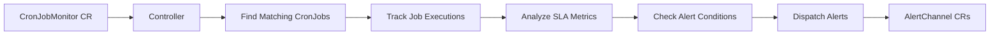
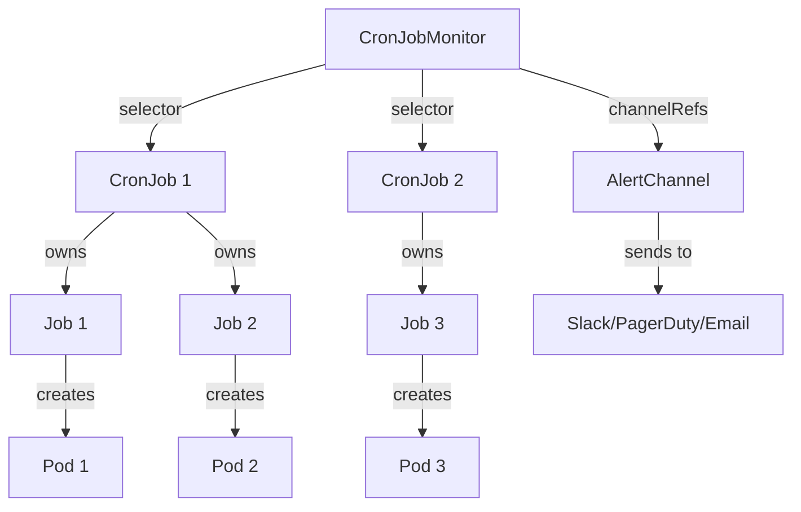

## Introduction

CronJob Guardian is a Kubernetes operator that provides comprehensive monitoring, SLA tracking, and intelligent alerting for CronJobs. It acts as a vigilant watchdog for your scheduled workloads, detecting failures, performance regressions, and missed schedules before they impact your business.

## How It Works

CronJob Guardian operates through a reconciliation loop that continuously monitors your CronJobs:



### Core Components

<CardGroup cols={2}>
  <Card title="CronJobMonitor Controller" icon="gears">
    Reconciles CronJobMonitor resources, discovers matching CronJobs, and orchestrates monitoring workflows.
  </Card>
  <Card title="Job Handler" icon="clock">
    Watches Job completions, records execution history, and extracts failure context (logs, events, exit codes).
  </Card>
  <Card title="SLA Analyzer" icon="chart-line">
    Calculates success rates, duration percentiles (P50/P95/P99), and detects performance regressions.
  </Card>
  <Card title="Alert Dispatcher" icon="bell">
    Routes alerts to configured channels with deduplication, rate limiting, and delayed dispatch support.
  </Card>
</CardGroup>

## Reconciliation Flow

The controller reconciles every 30 seconds and on CronJob changes:

<Steps>
  <Step title="Selector Evaluation">
    The controller evaluates the monitor's `selector` to find matching CronJobs. Selectors support:
    - Label matching (`matchLabels`, `matchExpressions`)
    - Explicit name lists (`matchNames`)
    - Multi-namespace monitoring (`namespaces`, `namespaceSelector`, `allNamespaces`)
  </Step>
  
  <Step title="Execution History Lookup">
    For each matched CronJob, the controller queries the database for recent execution history including:
    - Last successful execution time and duration
    - Last failed execution with exit code and reason
    - Success rate over the configured window (default: 7 days)
    - Duration percentiles for performance tracking
  </Step>
  
  <Step title="Alert Condition Checks">
    The analyzer checks multiple conditions in parallel:
    - **Dead-Man's Switch**: Has a job not run within the expected interval?
    - **Job Failures**: Did the last execution fail?
    - **SLA Violations**: Is success rate below threshold? Did duration exceed max?
    - **Performance Regression**: Has P95 duration increased significantly?
  </Step>
  
  <Step title="Alert Dispatch">
    When conditions trigger, alerts are dispatched through the configured channels:
    - Duplicate suppression prevents alert storms (default: 1 hour window)
    - Alert delay allows transient issues to self-resolve
    - Suggested fixes provide actionable remediation steps
  </Step>
  
  <Step title="Status Update">
    The controller updates the monitor's status with:
    - Per-CronJob health status (healthy/warning/critical)
    - Active alerts and their severity
    - Aggregate metrics (total runs, success rate, duration percentiles)
  </Step>
</Steps>

## Data Flow

### Execution Recording

When a Job completes, the Job Handler:

1. **Identifies the parent CronJob** via owner references
2. **Extracts execution metadata**:
   - Start and completion times
   - Success/failure status
   - Exit code and termination reason
3. **Gathers contextual data**:
   - Pod logs (configurable lines, default: 50)
   - Kubernetes events related to the pod
   - Container statuses and resource usage
4. **Generates suggested fixes** by matching failure patterns:
   - OOM kills → increase memory limits
   - Connection timeouts → check network policies
   - Exit code 143 → graceful shutdown timeout
5. **Stores execution record** in the database for historical analysis

### Metrics Calculation

The SLA Analyzer computes metrics on-demand during reconciliation:

```go
// From internal/analyzer/sla.go
type CronJobMetrics struct {
    SuccessRate        float64  // Percentage of successful runs
    TotalRuns          int32    // Total executions in window
    SuccessfulRuns     int32    // Successful executions
    FailedRuns         int32    // Failed executions
    AvgDurationSeconds float64  // Average duration
    P50DurationSeconds float64  // Median duration
    P95DurationSeconds float64  // 95th percentile
    P99DurationSeconds float64  // 99th percentile
}
```

Metrics are calculated over a rolling window (default: 7 days) and cached for performance.

## Resource Relationships



<Info>
  A single CronJobMonitor can watch multiple CronJobs, even across namespaces. This enables centralized monitoring policies for related workloads.
</Info>

## Controller Architecture

The controller follows Kubernetes operator best practices:

### Finalizers

CronJobMonitors use finalizers (`guardian.illenium.net/finalizer`) to ensure graceful cleanup:
- Clear all pending alerts for the monitor
- Optionally purge execution history based on `dataRetention.onCronJobDeletion`

### Status Updates

Status updates use optimistic concurrency control with retry logic:
- The controller detects mid-reconcile spec changes via generation tracking
- Conflicts trigger immediate requeues to recompute with fresh data
- Status reflects the observed generation to indicate reconciliation state

### Watch Triggers

The controller reconciles on:
1. **CronJobMonitor changes**: Spec updates (generation changes)
2. **CronJob changes**: Creation, updates, deletions of matched CronJobs
3. **Periodic requeues**: Every 30 seconds for continuous monitoring

## Performance Considerations

<Accordion title="Database Queries">
  The controller executes one query per CronJob per reconciliation to fetch:
  - Last execution (for failure detection)
  - Last successful execution (for dead-man's switch)
  - Metrics over the configured window (for SLA tracking)
  
  Queries use database indexes on `(cronjob_namespace, cronjob_name, start_time)` for efficiency.
</Accordion>

<Accordion title="Schedule Parsing Cache">
  Cron schedule parsing is expensive. The analyzer maintains an LRU cache (max 1000 entries) of parsed schedules to avoid repeated parsing:
  
  ```go
  // From internal/analyzer/sla.go:298
  cache := getScheduleCache()
  if sched, ok := cache.Get(schedule); ok {
      // Use cached parsed schedule
  }
  ```
</Accordion>

<Accordion title="Alert Deduplication">
  The dispatcher maintains in-memory maps of sent alerts with periodic cleanup:
  - `sentAlerts`: Tracks last sent time for duplicate suppression
  - `activeAlerts`: Stores active alert details for error signature comparison
  - Cleanup runs hourly to remove alerts older than 24 hours
</Accordion>

## Next Steps

<CardGroup cols={2}>
  <Card title="CronJobMonitor CRD" icon="file-code" href="/concepts/cronjob-monitor">
    Deep dive into all CronJobMonitor fields and configuration options
  </Card>
  <Card title="AlertChannel CRD" icon="satellite-dish" href="/concepts/alert-channels">
    Learn how to configure Slack, PagerDuty, email, and webhook alerts
  </Card>
  <Card title="Dead-Man's Switch" icon="heart-pulse" href="/concepts/dead-man-switch">
    Understand how missed schedule detection works
  </Card>
  <Card title="SLA Tracking" icon="chart-mixed" href="/concepts/sla-tracking">
    Explore success rate tracking and regression detection
  </Card>
</CardGroup>
