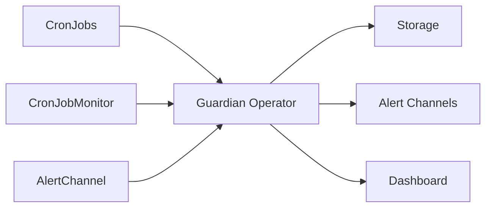

## What is CronJob Guardian?

CronJob Guardian is a Kubernetes operator that monitors CronJobs with SLA tracking, intelligent alerting, and a built-in dashboard. It ensures your critical scheduled jobs run successfully and alerts you when something goes wrong.

## The Problem

CronJobs power critical operations like backups, ETL pipelines, and reports—but Kubernetes provides no built-in monitoring for them. When jobs fail silently or stop running, you only find out when it's too late.

Common issues that go undetected:

- **Silent failures**: Jobs fail but no one knows until data is missing
- **Jobs stop running**: Schedule issues or resource constraints prevent execution
- **Performance degradation**: Jobs slow down gradually over time
- **Resource leaks**: Failed jobs consume cluster resources

## How Guardian Helps

CronJob Guardian watches your CronJobs and alerts you when something goes wrong, with rich context to help you diagnose and fix issues quickly.

### Key Features

<CardGroup cols={2}>
  <Card title="Dead-Man's Switch" icon="bell">
    Alert when CronJobs don't run within expected windows. Automatically calculates thresholds from cron schedules or set custom intervals.
  </Card>
  
  <Card title="SLA Tracking" icon="chart-line">
    Monitor success rates, duration percentiles (P50/P95/P99), and detect regressions. Set minimum success rates and maximum duration thresholds.
  </Card>
  
  <Card title="Intelligent Alerts" icon="lightbulb">
    Get rich context with pod logs, Kubernetes events, and suggested fixes. Alerts include everything you need to diagnose the issue.
  </Card>
  
  <Card title="Multiple Channels" icon="message">
    Send alerts to Slack, PagerDuty, webhooks, or email. Route different severities to different channels.
  </Card>
  
  <Card title="Built-in Dashboard" icon="chart-area">
    Feature-rich web UI with charts, heatmaps, execution history, and CSV exports. No external tools required.
  </Card>
  
  <Card title="Prometheus Metrics" icon="gauge">
    Export metrics for existing monitoring infrastructure. Integrates with your existing observability stack.
  </Card>
</CardGroup>

## Architecture

CronJob Guardian runs as a single operator pod in your cluster with three main components:



- **Operator**: Watches CronJobs and Jobs, tracks execution history, calculates SLA metrics
- **Storage**: SQLite (default), PostgreSQL, or MySQL for execution history and metrics
- **Dashboard**: Embedded web UI for viewing metrics and execution history
- **Custom Resources**: `CronJobMonitor` and `AlertChannel` define what to monitor and where to alert

## Who Should Use This?

CronJob Guardian is ideal for teams that:

- Run critical scheduled jobs (backups, ETL, reports)
- Need to maintain SLA commitments
- Want to catch failures before customers notice
- Need visibility into job performance and trends
- Want centralized monitoring across multiple namespaces or clusters

## Example Use Cases

### Database Backups

Ensure nightly backups run successfully with 100% success rate monitoring:

```yaml
spec:
  selector:
    matchLabels:
      type: backup
  deadManSwitch:
    enabled: true
    maxTimeSinceLastSuccess: 25h  # Daily + 1h buffer
  sla:
    enabled: true
    minSuccessRate: 100  # Backups must never fail
  alerting:
    channelRefs:
      - name: pagerduty-oncall
```

### ETL Pipelines

Monitor data pipelines with duration regression detection:

```yaml
spec:
  selector:
    matchLabels:
      type: etl
  sla:
    enabled: true
    maxDuration: 30m
    durationRegression:
      enabled: true
      percentile: 95
      thresholdPercent: 50  # Alert if P95 increases 50%
```

### Financial Reports

Quiet alerts during planned maintenance:

```yaml
spec:
  selector:
    matchLabels:
      type: report
  maintenanceWindows:
    - name: monthly-maintenance
      schedule: "0 2 1 * *"  # First day of month at 2 AM
      duration: 4h
```

## What's Next?

<CardGroup cols={2}>
  <Card title="Quickstart" icon="rocket" href="/quickstart">
    Get CronJob Guardian running in 5 minutes
  </Card>
  
  <Card title="Installation" icon="download" href="/installation">
    Detailed installation guide with all configuration options
  </Card>
  
  <Card title="Core Concepts" icon="book" href="/concepts/overview">
    Learn about monitors, alert channels, and SLA tracking
  </Card>
  
  <Card title="Examples" icon="code" href="/examples/basic-monitor">
    Real-world configuration examples
  </Card>
</CardGroup>
